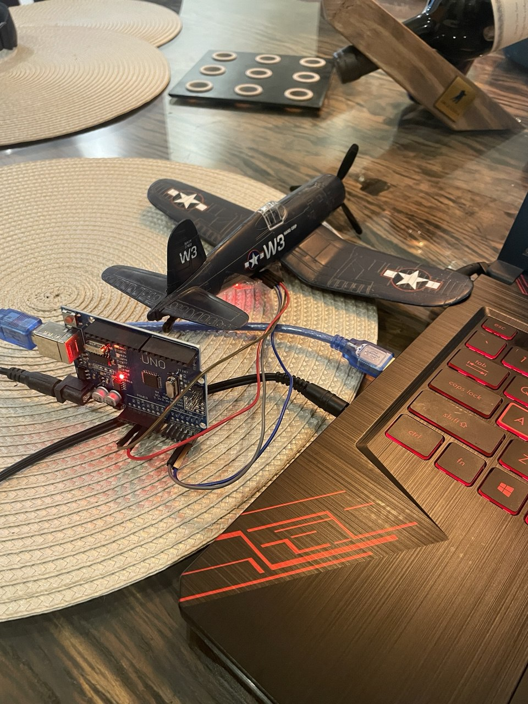

# giroscopio
Software com interface gráfica que simula o horizonte artificial de uma aeronave (Giroscópio).

---

##  Visão Geral

Contém Uma placa **Arduino** para coleta dados de **inclinação (pitch)** e **rolagem (roll)** a partir de um acelerômetro **MPU6050**, e envia essas informações ao computador via **comunicação serial**.  

No computador, um script Python, utilizando **Tkinter** e **PySerial**, exibe esses dados em tempo real em uma interface gráfica que simula o horizonte artificial de uma aeronave.

Demonstração no YouTube:  
[https://youtube.com/shorts/nl1kET7p0yA?si=YtbqkHNL75Do1jj0](https://www.youtube.com/shorts/DRqX0Btrs8Y)

---

##  Arquivos do Projeto

| Arquivo | Descrição |
|--------|-----------|
| `Arduino_live_att_indicat.py` | Script Python que lê dados reais da porta serial com Arduino e atualiza o horizonte artificial ao vivo. |
| `MPU_pitch_roll_Pyt_comm.ino` | Código para ser carregado no Arduino. Lê dados do MPU6050, calcula os ângulos de pitch e roll, e envia por serial. 

Baseado no tutorial da Carbon Aeronautics. [Assista aqui](https://youtu.be/7VW_XVbtu9k?si=yDsCyBnuSdUbkwY7) |

---

##  Instruções e Recomendações

- **Orientação correta do acelerômetro** é essencial. Se necessário, inverta os sinais dos ângulos de acordo com a convenção aeronáutica:
  - Roll positivo → Asa direita abaixada
  - Pitch positivo → Nariz para cima

---

##  Componentes Necessários

- Placa **Arduino Uno** (ou compatível)  
- Acelerômetro **MPU6050**  
- Cabo **USB**  
- Computador com **Python 3.x**

---

##  Software e Bibliotecas Requeridas

### Arduino
- [Arduino IDE](https://www.arduino.cc/en/software)

### Python
- [Python 3.x](https://www.python.org/)
- Bibliotecas:
  - `tkinter`
  - `pyserial`
  - `numpy`
  - `math`

---

## Créditos

- Código do Arduino baseado no tutorial da **Carbon Aeronautics**.  
  [Tutorial completo no YouTube](https://youtu.be/7VW_XVbtu9k?si=yDsCyBnuSdUbkwY7)

---

